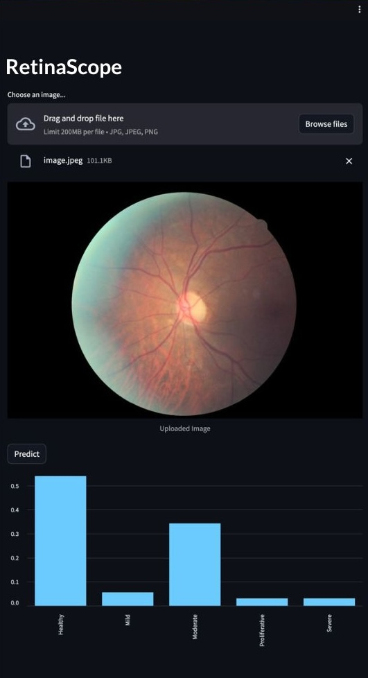
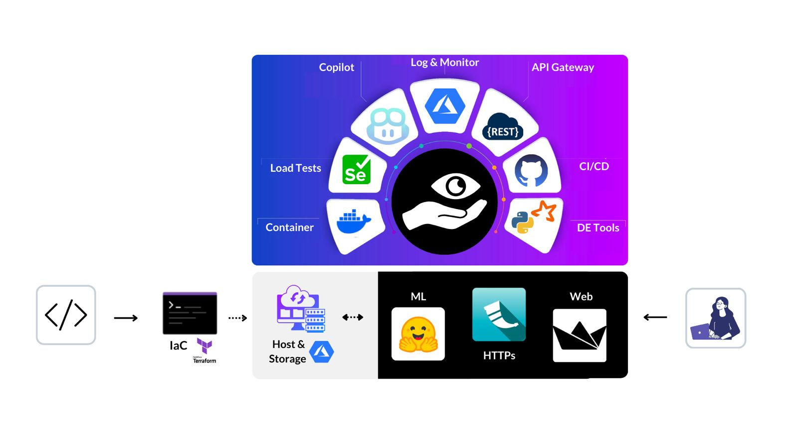
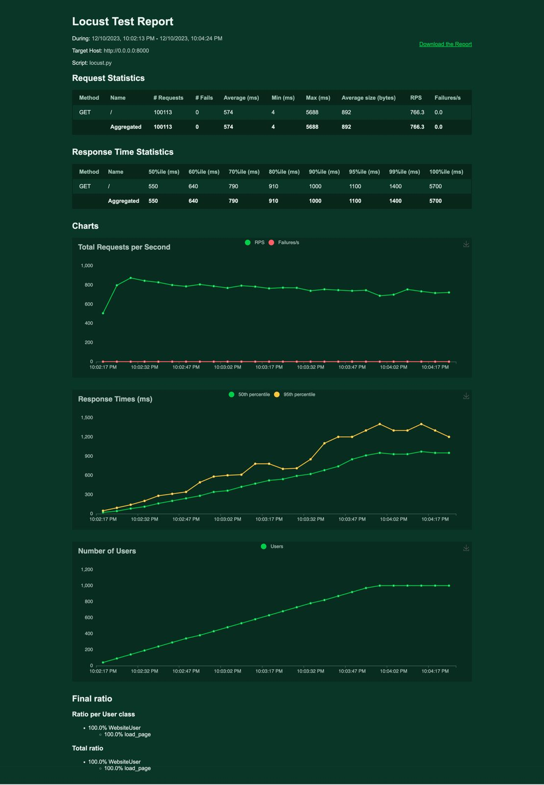
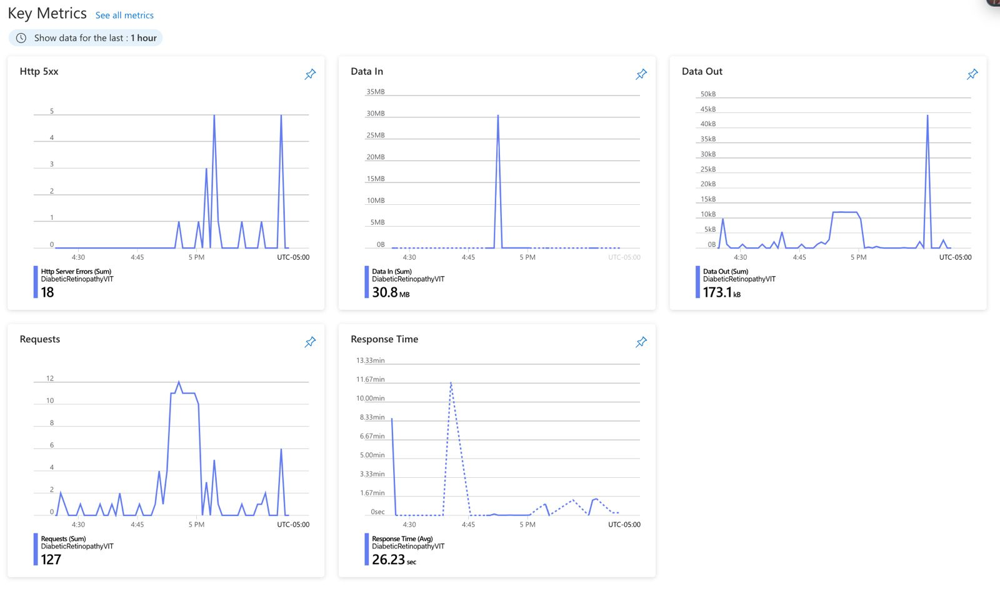

# Diabetic Retinopathy detection using Vision Transformer 

# Demo Video 
https://clipchamp.com/watch/hvZq74ybHm1

# About
The US Center for Disease Control and Prevention says around 29.1 million people in the US have diabetes, and globally, the World Health Organization estimates 347 million people have the disease. Diabetic Retinopathy (DR) is an eye problem linked to long-term diabetes. About 40-45% of Americans with diabetes have some level of DR. If DR is found early, the risk of vision loss can be reduced, but it's hard to detect early because it often has few symptoms until it's too late for effective treatment.

Right now, finding DR takes a lot of time and involves a person looking at photos of the retina. Human reviewers take a day or two to give results, leading to problems like missed follow-ups and delayed treatment.

Doctors can identify DR by looking for certain signs in the retina, but this method needs a lot of resources. Places with high diabetes rates often lack the expertise and tools for this kind of detection. As more people get diabetes, the resources needed to prevent blindness from DR will be even more stretched.

People have recognized the need for an easy and automated way to screen for DR for a long time. Previous efforts have made progress using technology like image recognition and machine learning. In this competition, the goal is to create a system that can automatically detect DR from color photos of the retina. The hope is to make a model that can be widely used to improve DR detection, and the winning models will be shared with the public to have the biggest impact.

# Usage
## Setup
1. First, clone the repo: 
   `git clone https://github.com/titusrobin/diabetic-retinopathy-vit.git`
2. Then, cd into the project directory and install the dependencies: 
   `cd diabetic-retionpathy-vit` 
   `make install`
3. Launch the app: 
   `python -m streamlit run app.py --server.port 8000 --server.address 0.0.0.0`

## Application
The application takes the image of a retina and outputs the probabilities for five classes: Healthy, Mild, Moderate, Proliferative, Severe. The images can be uploaded from a local computer using the upload button. Clicking on the `Predict` calls the model and generates probabilities for the five classes.

# Architecture 

# Main Components
1. Infrastructure as Code (IaC): We use terraform to acomplish IaC.
2. CI/CD Pipeline: We implement the CI and CD workflows separately. The CD workflow was generated by connecting the Azure Web Service to the github repo.
3. GitHub Configurations: We configure GitHub actions to run the workflows on each push and include a `.devcontainer` to configure the codespace on creation.

# Load Test

# Azure Logs

# Limitations
- The model accuracy is not high enough that it can be used with complete trust. Rather, it is meant to complement the diagnoses of medical professionals.
- Due to the cost constraints, we may not be able to host the website for an extended period of time. However, the functioning can be adequately tested on a local codespace by following the steps in the Usage section.

# Use of GitHub Copilot
Most of this code was written with the help of GitHub Copilot.

Copilot is an AI programming assistant that's set to transform your development process. This ingenious companion simplifies the daunting task of translating code from Python to Rust, a process that can be both time-consuming and error-prone. It's not just about faster coding but ensuring greater accuracy in the transformation.

Copilot automates the creation of boilerplate code necessary for building Command-Line Interface (CLI) tools. That means less manual work and more streamlined tool setup.

Once your Rust code is written, you can rely on automated workflows to handle code formatting, linting, and testing. This ensures that your code aligns with best practices and is well-prepared for deployment.

In a nutshell, Copilot makes coding more efficient and accurate, improving code organization, and simplifying the setup of CLI tools. It's a valuable ally in your development journey.

